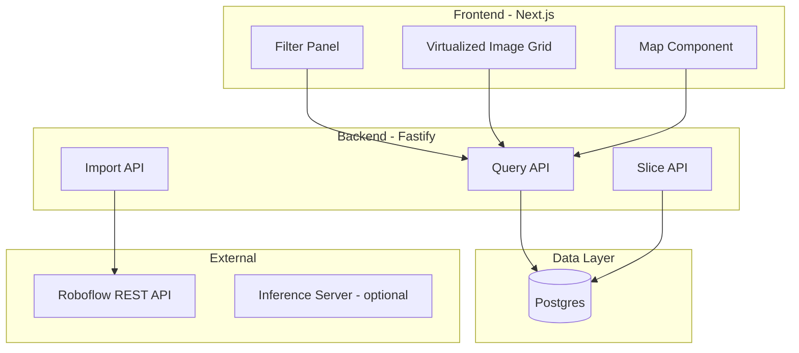

# Architecture

## Overview

```mermaid
flowchart TB
    subgraph frontend [Frontend - Next.js]
        FilterPanel[Filter Panel]
        ImageGrid[Virtualized Image Grid]
        MapView[Map Component]
    end

    subgraph backend [Backend - Fastify]
        ImportAPI[Import API]
        QueryAPI[Query API]
        SliceAPI[Slice API]
    end

    subgraph data [Data Layer]
        Postgres[(Postgres)]
    end

    subgraph external [External]
        RoboflowAPI[Roboflow REST API]
        Inference[Inference Server - optional]
    end

    FilterPanel --> QueryAPI
    ImageGrid --> QueryAPI
    MapView --> QueryAPI
    ImportAPI --> RoboflowAPI
    QueryAPI --> Postgres
    SliceAPI --> Postgres
```
